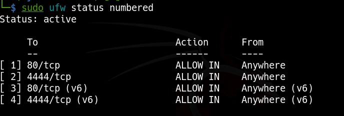
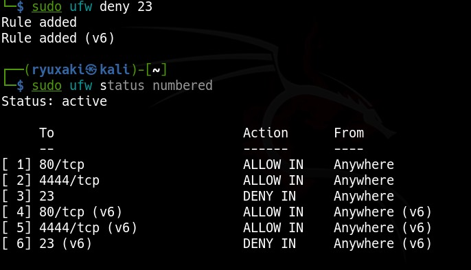
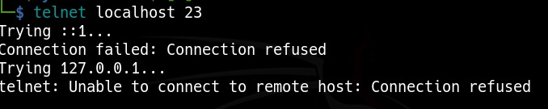
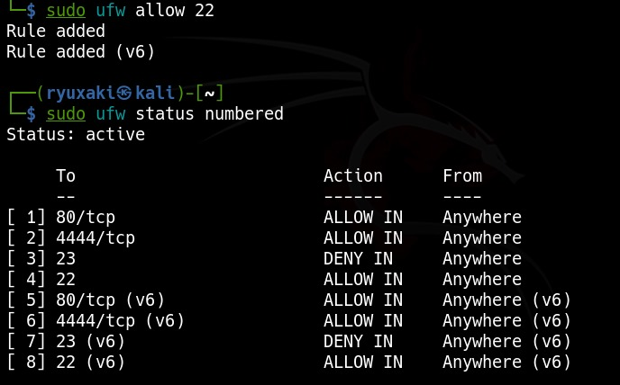
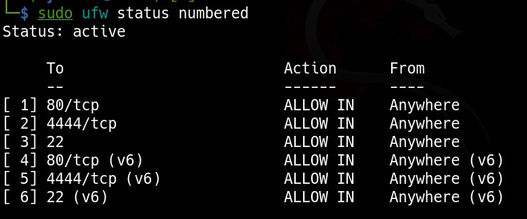

# Ufw-Configs


## UFW Firewall Configuration Task

This task documents how I configured and tested basic firewall rules using **UFW** (Uncomplicated Firewall) on Linux.

---

## 🎯 Objective
Configure and test firewall rules to allow or block traffic using UFW.

---

## 🧰 Tools Used
- UFW (Linux)
- Telnet (for testing)
- Linux Terminal

---

## 📋 Steps Done

### 1️⃣ Checked if UFW is installed and running
```bash
sudo ufw status
```

If not installed:
```bash
sudo apt install ufw
```

### 2️⃣ Enable UFW
```bash
sudo ufw enable
```

### 3️⃣ List Current Firewall Rules
```bash
sudo ufw status numbered
```
**Screenshot:** 

### 4️⃣ Block Port 23 (Telnet)
```bash
sudo ufw deny 23
```
**Screenshot:** 

### 5️⃣ Test the Telnet Block
If Telnet is not installed:
```bash
sudo apt install telnet
```

Then test the blocked port:
```bash
telnet localhost 23
```
Expected result: **Connection refused**

**Screenshot:** 

### 6️⃣ Ensure SSH (Port 22) is Allowed
```bash
sudo ufw allow 22
```
**Screenshot:** 

### 7️⃣ Remove Telnet Rule to Restore Original State
First, list rules with numbers:
```bash
sudo ufw status numbered
```

Then delete the Telnet rule (example shown as rule 2):
```bash
sudo ufw delete 3
sudo ufw delete 7
```
**Screenshot:** 

---

## 🧠 Summary: How Firewall Filters Traffic
* UFW acts as a gatekeeper for network traffic.
* **Allow rules** open access to specific ports/services.
* **Deny rules** block insecure or unwanted access (e.g., Telnet).
* Rules are tested manually to confirm they work.
* Temporary test rules (like Telnet block) should be removed after testing.
